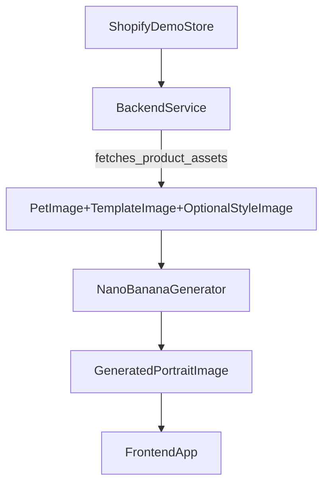

# Shopify → NanoBanana → Frontend (POC)

This folder documents the **next integration step** for this project: using a Shopify demo store (with a small set of products) as the source of inputs, running **NanoBanana** image generation on the backend, then showing the generated result in the frontend.

## What you said you set up in Shopify

In the Shopify demo store you added ~5–6 products. Each product includes:
- a **pet image**
- a **template image**
- an optional **reference/style image**
- basic pet details (metadata)

The desired behavior is:
1) backend fetches product data/assets from Shopify
2) backend runs NanoBanana generation using those images
3) frontend displays the generated image

## How this relates to the existing code in this repo

This repo already contains a working local pipeline + API skeleton under:
- `src/portrait_automation/`
- FastAPI app: `src/portrait_automation/api/main.py`

Important implementation notes:
- The current generator in this repo is **`composite`** (deterministic local blend) to validate masking/placement/integrity checks.
- NanoBanana is represented as a **stub adapter** you’ll implement:
  - `src/portrait_automation/generator/nanobanana_stub.py`
  - and selected via `GENERATOR=nanobanana` in `.env`

## Target end-to-end flow

## Backend responsibilities (POC)

- **Fetch products** (or a curated list) from Shopify
  - Read product metafields / attachments for:
    - `pet_image`
    - `template_image`
    - `style_image` (optional)
    - pet metadata
- **Download assets** to temporary storage
- Call the generator pipeline (conceptually the same inputs as `/generate-simple`)
  - `pet` (required)
  - `template` (required)
  - `style_image` (optional; best quality because it enables mask derivation)
- **Store outputs** (local disk for POC; object storage later)
- Return a payload the frontend can render:
  - generated image URL/path
  - validation status (optional)

## Frontend responsibilities (POC)

- Call backend endpoint like:
  - `GET /products` (list Shopify products with their attached assets)
  - `POST /generate/{productId}` (kick off generation)
- Display:
  - pet/template/style images (inputs)
  - generated image (output)
  - status/validation info

## What to implement next (no code in this folder)

This folder is intentionally documentation-only. The next concrete work items are:
- implement Shopify fetching in a backend module (products + image assets)
- implement the NanoBanana adapter (`nanobanana_stub.py`)
- add endpoints that map Shopify product IDs to generation jobs/results
- add minimal frontend screens to trigger generation and view results

